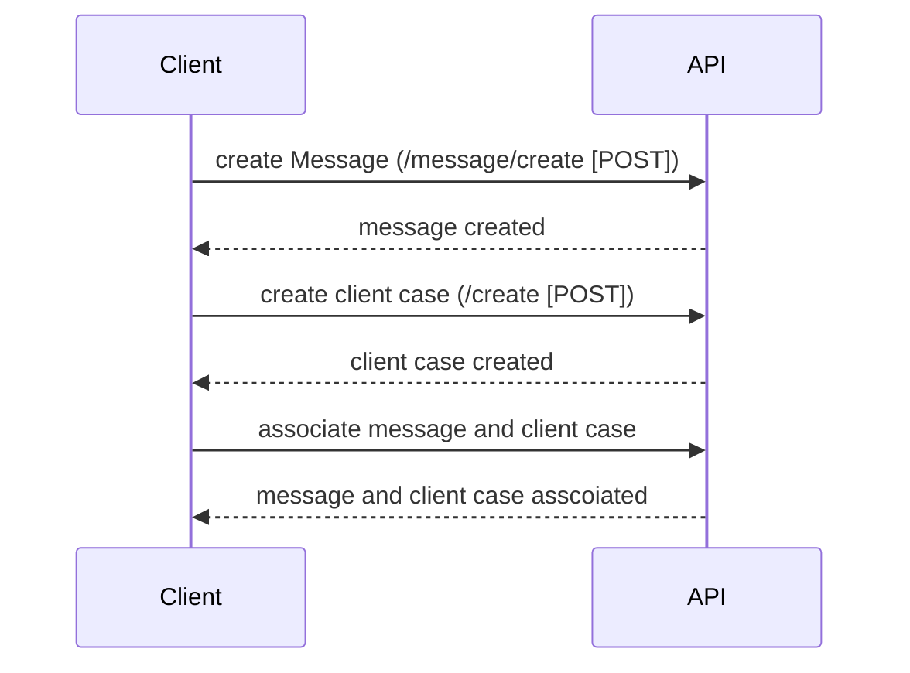

# INSSO backend code exercise

Source code developed by raimundomlj@gmail.com as INSSO backend code exercise

# Tech stack

**Java 8**.
**Spring boot**.
**H2 in memory database**.
**Junit**
**Javax Validation**
**Swagger**

# How to run

Using the .jar file on project root folder 
```
insso_backend_code_exercise-0.0.1-SNAPSHOT.jar
``` 

or by maven on project root folder using: 
```
mvn spring-boot:run
```

When this code is running, the server will be available at http://localhost:8080

# Documentation and endpoints

This project uses Swagger. 
Documentation and endpoints can be found in: http://localhost:8080/swagger-ui.html#/

# Payload examples

### Create a new message to be associated after to a client case using /associate endpoint

>**Valid channels: MAIL, SMS, FACEBOOK, TWITTER**

```
/message/create [POST]

{
  "authorName": "Jérémie Durand",
  "channel": "MAIL",
  "messageContent": "Hello, I have an issue with my new phone"
}
```
### Create a new client case to be associated after to message using /associate endpoint
```
/create [POST]

{
  "clientName": "Jérémie Durand",
  "reference": "XPTO"
}
```
### Associate client case to message(s) using client case and message identifiers
```
/associate[POST]

{
  "clientCaseId": 1,
  "messageId": [
    1
  ]
}
```
####  sequence how to associate message to client case

### Modify client case fields
>**blank fields are ignored**
```
/associate[POST]

{
  "clientCaseId": 1,  
  "reference": "KA-18B6"
}
```
### Fetch all case fields
```
/get-all[GET]

```

# Custom Errors
##### VALIDATION_ERROR : occur when field are not correct, send a list with all wrong fields
##### NOT_SAVED:occur when is not possible save on database
##### EMPTY_LIST: occur when are not data on database 
##### NOT_FOUND: occur when is not possible found data on database   
##### NOT_POSSIBLE : occur when is not possible complete a request 